# BookPlace

Projekt zaliczeniowy z przedmiotu **Techniki Projektowania Frontendowego** (TPF). Aplikacja webowa wzorowana na serwisach typu Airbnb / Booking, pozwalająca przeglądać oferty noclegowe, rezerwować pobyty, prowadzić panel hosta i czat między gościem a gospodarzem.

Aplikacja jest w pełni frontendowa — autentykacja realizowana jest przez **Firebase Authentication** (BaaS, działa bez własnego backendu), pozostałe dane (oferty, rezerwacje, czat, recenzje) pochodzą z mocków w [frontend/src/mocks/](frontend/src/mocks/).

## Live demo

> **URL produkcyjny:** [https://bookplace-jkzehz4xz-balicz3ks-projects.vercel.app](https://bookplace-jkzehz4xz-balicz3ks-projects.vercel.app)

Deploy: **Vercel** (auto-deploy z gałęzi `main`).

## Stack technologiczny

- **React 19** + **TypeScript** + **Vite**
- **Material UI v7** (`@mui/material`, `@mui/icons-material`, `@mui/x-date-pickers`)
- **React Router v7** (routing klienta, chronione trasy)
- **Firebase Authentication** (email + hasło)
- **react-ga4** — Google Analytics 4
- **@hotjar/browser** — Hotjar (integracja w toku)
- **Leaflet + react-leaflet** — mapa oferty
- **FullCalendar** — kalendarz hosta
- **Swiper** — galerie zdjęć

## Struktura projektu

```
BookPlace-TPF/
├── frontend/                # cała aplikacja React
│   └── src/
│       ├── pages/             # widoki przypisane do tras (React Router)
│       ├── components/
│       │   ├── common/        # reużywalne komponenty (Header, OfferCard, BookingCard, PaginationControls, UserMenu, ...)
│       │   ├── features/      # komponenty domenowe (auth, booking, chat, checkout, host, offer, search)
│       │   └── layout/        # MainLayout
│       ├── contexts/auth/     # AuthContext + AuthProvider (Firebase Auth)
│       ├── database/client.ts # initializeApp + getAuth
│       ├── hooks/             # useAuth, useBooking, useChat, useOffers, useReviews
│       ├── mocks/             # mockowane dane ofert, rezerwacji, czatu, recenzji
│       ├── models/            # typy TS (OfferModels, HostModels, ChatModels, ReviewModels)
│       ├── utils/ga.ts        # wrapper na react-ga4
│       ├── App.tsx            # definicja wszystkich tras + AnalyticsListener
│       └── main.tsx           # BrowserRouter + ThemeProvider + AuthProvider
├── docs/screenshots/        # screeny do README
└── README.md
```

## Spełnienie checklisty TPF

| Wymaganie | Status | Gdzie w kodzie |
|---|---|---|
| Odwzorowanie prototypu | ✅ | wszystkie `pages/` + `components/` |
| Routing wszystkich ekranów (React Router) | ✅ | [frontend/src/App.tsx](frontend/src/App.tsx) — `<Routes>` |
| Podział na `pages/` | ✅ | [frontend/src/pages/](frontend/src/pages/) |
| Reużywalne komponenty | ✅ | [frontend/src/components/common/](frontend/src/components/common/), [components/features/](frontend/src/components/features/) |
| CSS / stylowanie | ✅ | MUI + theme [frontend/src/theme.ts](frontend/src/theme.ts) + `App.css` / `index.css` |
| Firebase Authentication | ✅ | [frontend/src/database/client.ts](frontend/src/database/client.ts), [contexts/auth/AuthContext.tsx](frontend/src/contexts/auth/AuthContext.tsx), [components/features/auth/](frontend/src/components/features/auth/) |
| Chronione trasy | ✅ | [components/features/auth/ProtectedRoute.tsx](frontend/src/components/features/auth/ProtectedRoute.tsx) |
| Google Analytics (GA4) | ✅ | [frontend/src/utils/ga.ts](frontend/src/utils/ga.ts), [components/AnalyticsListener.tsx](frontend/src/components/AnalyticsListener.tsx), inicjalizacja w [App.tsx](frontend/src/App.tsx) |
| Hotjar | ⏳ | integracja realizowana niezależnie — placeholder w README |
| Deploy aplikacji | ✅ | Vercel (link wyżej) |
| README ze screenami | ✅ | ten plik |

## Lista tras (React Router)

**Publiczne:**
- `/` — landing
- `/search` — wyniki wyszukiwania
- `/offer/:offerId` — szczegóły oferty
- `/booking/checkout` — checkout
- `/booking/confirmation` — potwierdzenie rezerwacji
- `/my-bookings`, `/my-bookings/:bookingId` — moje rezerwacje

**Chronione** (`ProtectedRoute` — wymaga zalogowania):
- `/inbox` — skrzynka użytkownika

**Chronione + rola `HOST`:**
- `/host/dashboard`
- `/host/bookings`
- `/host/calendar`
- `/host/offers`, `/host/offers/add`
- `/host/inbox`

## Lokalne uruchomienie

Wymagania: Node.js 20+.

```powershell
cd frontend
Copy-Item .env.example .env       # uzupełnij wartości z konsoli Firebase + GA4
npm install
npm run dev
```

Aplikacja dostępna pod http://localhost:5173.

### Wymagane zmienne środowiskowe (`frontend/.env`)

Pełna lista — skopiuj z [frontend/.env.example](frontend/.env.example):

```
VITE_FIREBASE_API_KEY=
VITE_FIREBASE_AUTH_DOMAIN=
VITE_FIREBASE_PROJECT_ID=
VITE_FIREBASE_STORAGE_BUCKET=
VITE_FIREBASE_MESSAGING_SENDER_ID=
VITE_FIREBASE_APP_ID=
VITE_FIREBASE_MEASUREMENT_ID=
VITE_GA4_MEASUREMENT_ID=G-XXXXXXXXXX
```

Wartości pobierasz z **Firebase Console → Project settings → Your apps → SDK setup and configuration** oraz **Google Analytics → Admin → Data Streams → Measurement ID**.

## Konta testowe / jak się zalogować

Autentykacja oparta o **Firebase Authentication (email + hasło)**. Możesz albo:

1. **Zarejestrować własne konto** w aplikacji (przycisk „Sign in" w prawym górnym rogu → zakładka „Sign up").
2. **Użyć gotowych kont** (poniżej).

> Aby otrzymać rolę `HOST` i widzieć trasy `/host/*`, email konta musi być w domenie `@host.com` — logika w [AuthContext.tsx](frontend/src/contexts/auth/AuthContext.tsx).

| Rola | Email | Hasło |
|---|---|---|
| USER | _do uzupełnienia_ | _do uzupełnienia_ |
| HOST | _do uzupełnienia (np. demo@host.com)_ | _do uzupełnienia_ |

## Deploy

Aplikacja zhostowana na **Vercel** (darmowy plan Hobby). Konfiguracja:

- **Root Directory:** `frontend`
- **Framework Preset:** Vite (auto-detected)
- **Build Command:** `npm run build`
- **Output Directory:** `dist`
- **Zmienne środowiskowe:** wszystkie `VITE_*` z `.env` ustawione w Project Settings → Environment Variables.
- **Firebase Authorized domains:** domena Vercela dodana w Firebase Console → Authentication → Settings → Authorized domains.

Każdy push na `main` → automatyczny deploy produkcyjny.

## Zrzuty ekranu — aplikacja

> Pliki w [docs/screenshots/app/](docs/screenshots/app/).

### Landing page
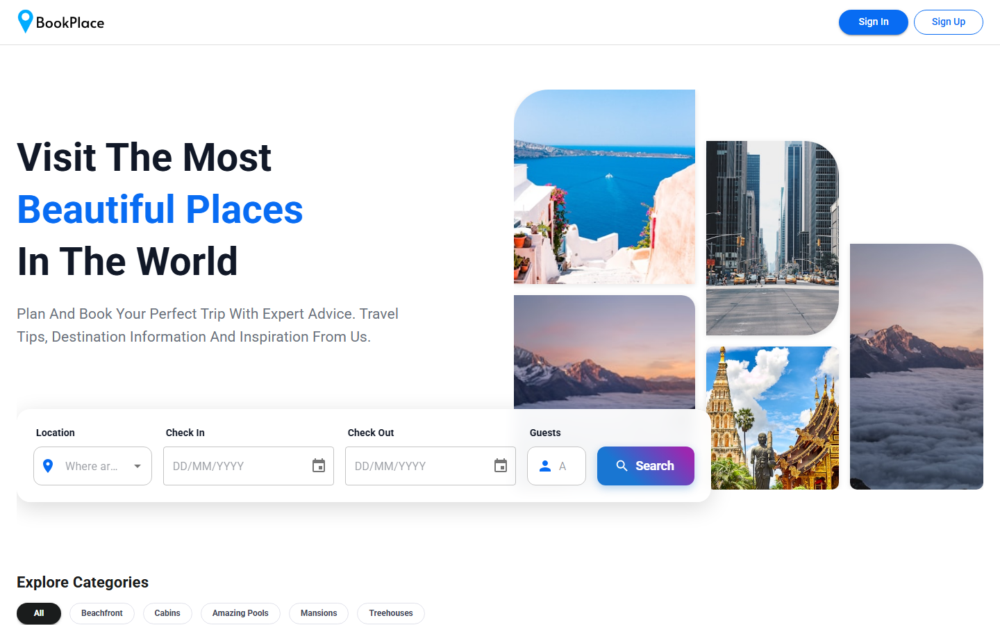

### Wyszukiwanie ofert
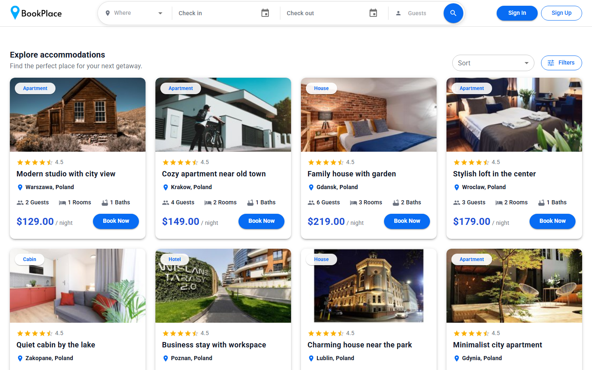

### Szczegóły oferty
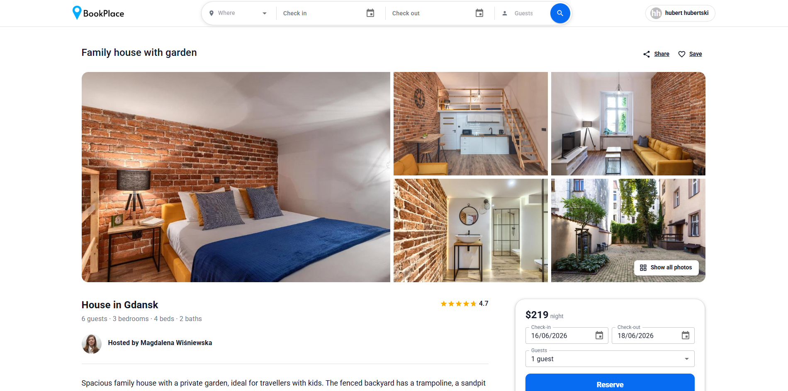

### Checkout
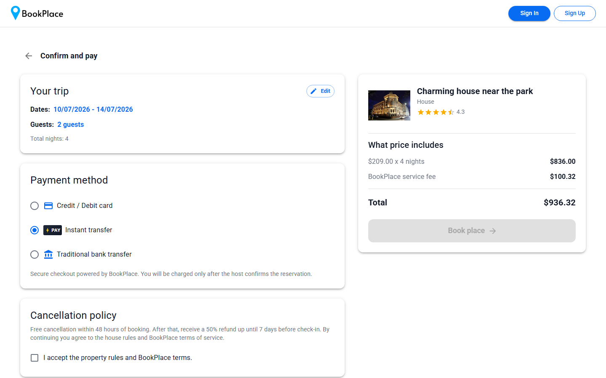

### Potwierdzenie rezerwacji
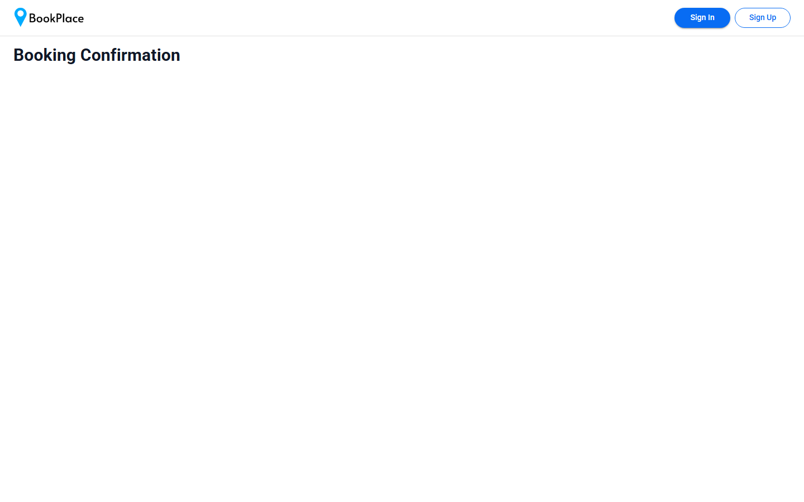

### Moje rezerwacje
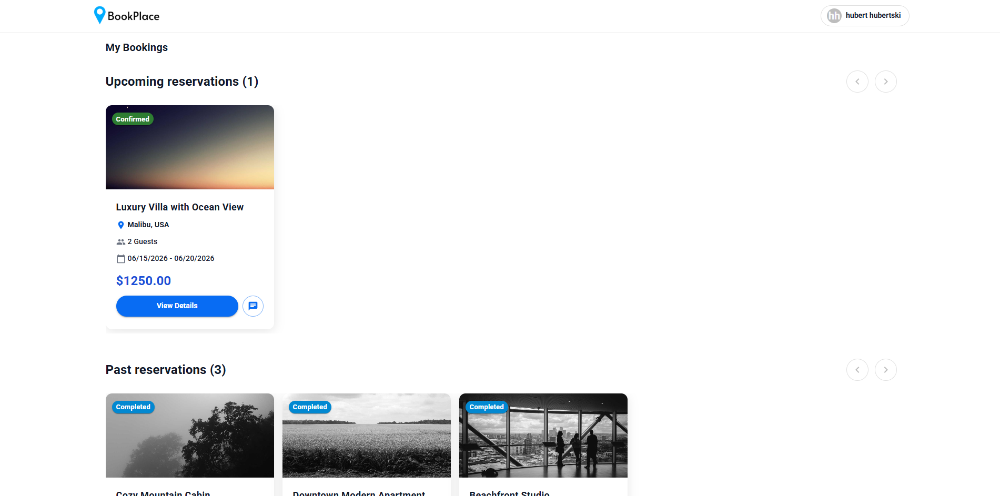

### Skrzynka / czat
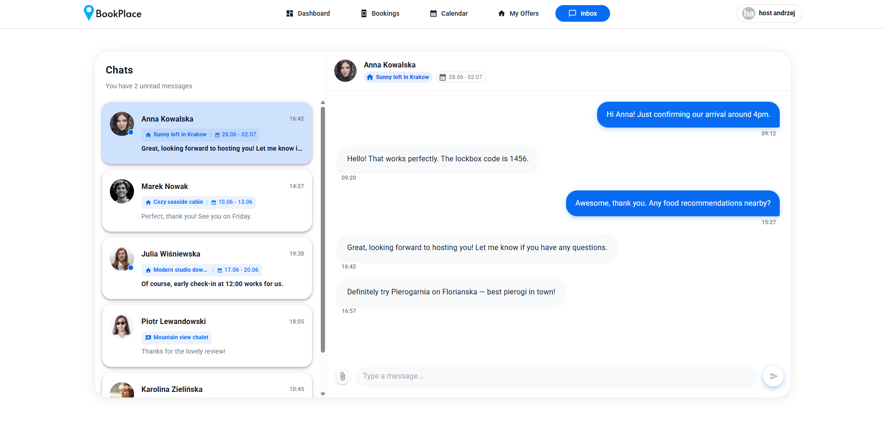

### Logowanie / rejestracja (modal)
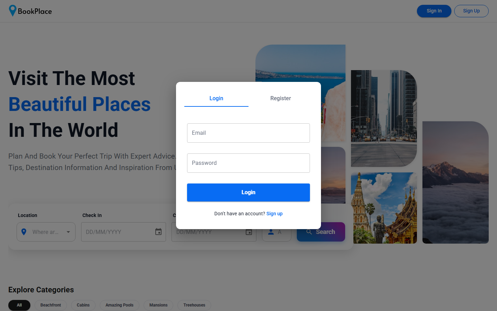

### Panel hosta — dashboard
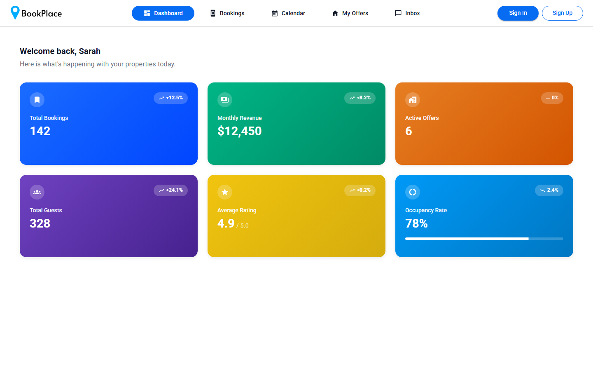

### Panel hosta — rezerwacje
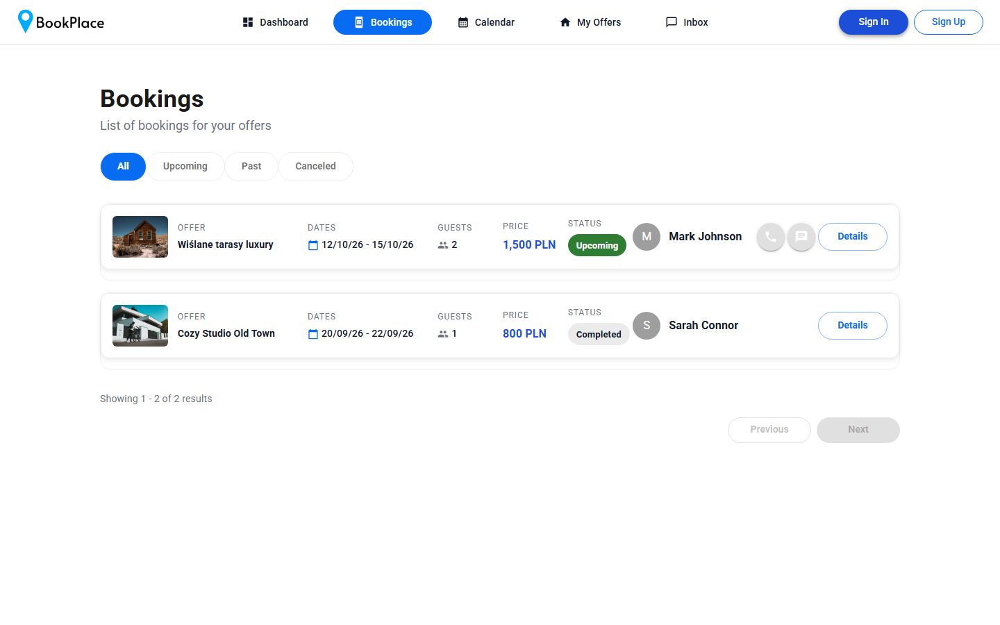

### Panel hosta — kalendarz
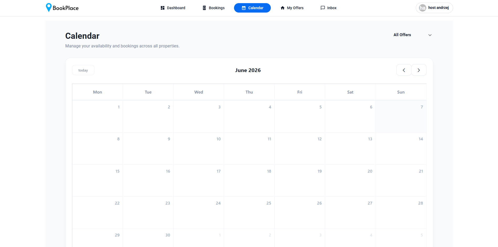

### Panel hosta — dodawanie oferty
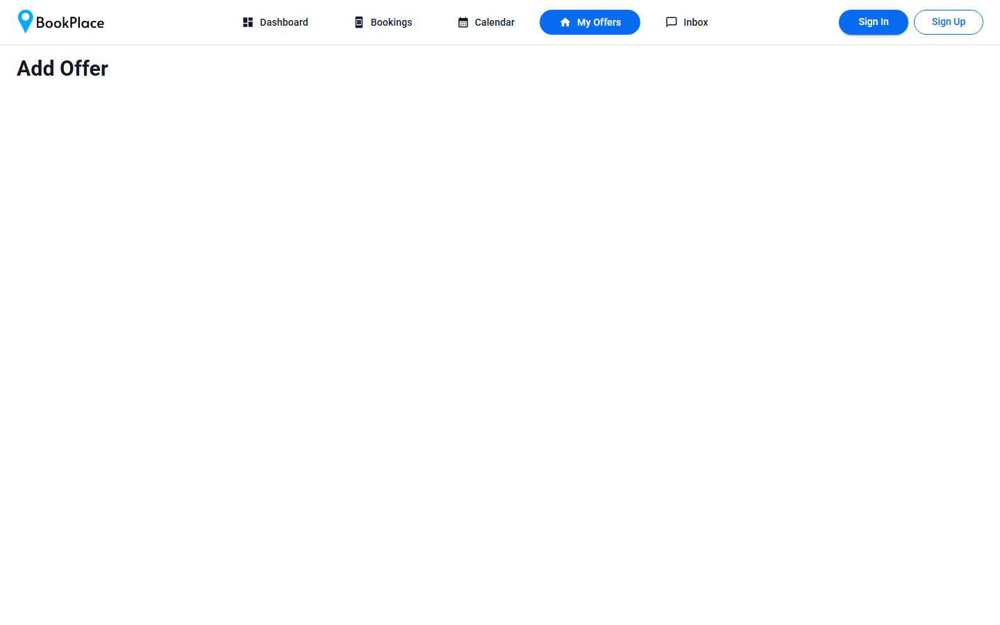

## Zrzuty ekranu — Google Analytics

> Pliki w [docs/screenshots/ga/](docs/screenshots/ga/).

### Realtime
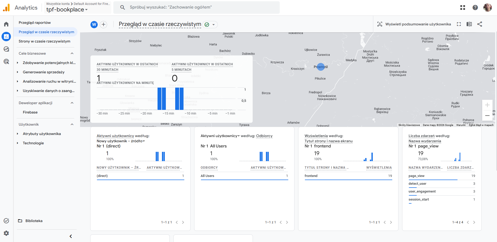

### Pages and screens
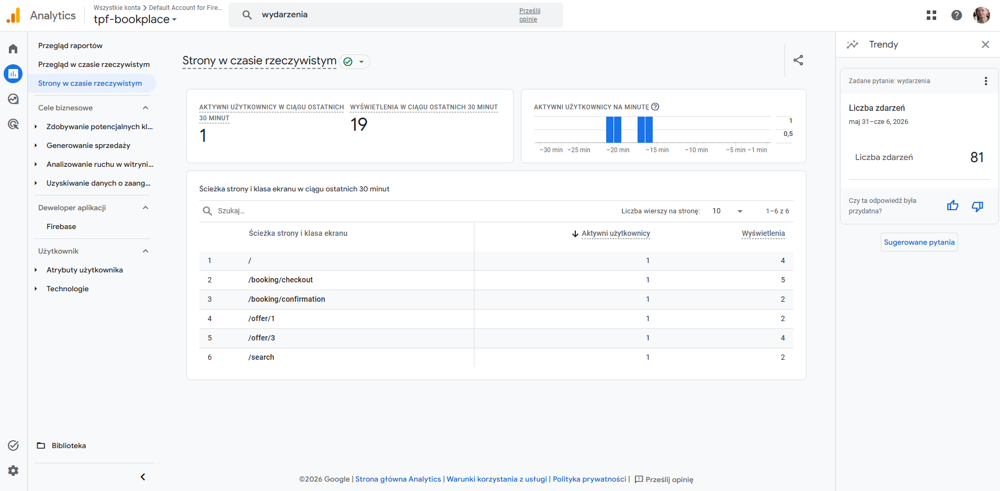

### Events


## Zrzuty ekranu — Hotjar

> Integracja Hotjar realizowana niezależnie. Poniżej placeholdery — zostaną zastąpione realnymi screenami po wdrożeniu.
>
> Pliki w [docs/screenshots/hotjar/](docs/screenshots/hotjar/).

### Dashboard
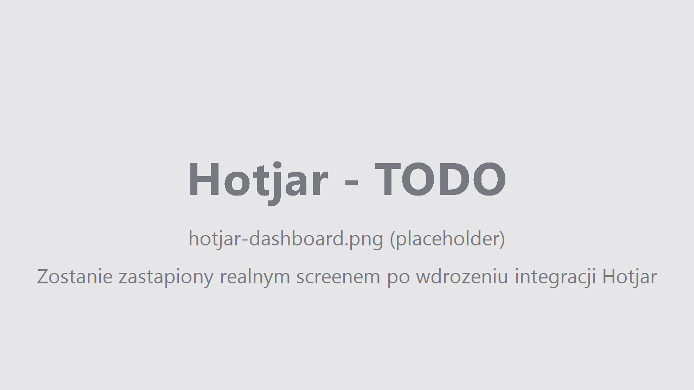

### Heatmapa
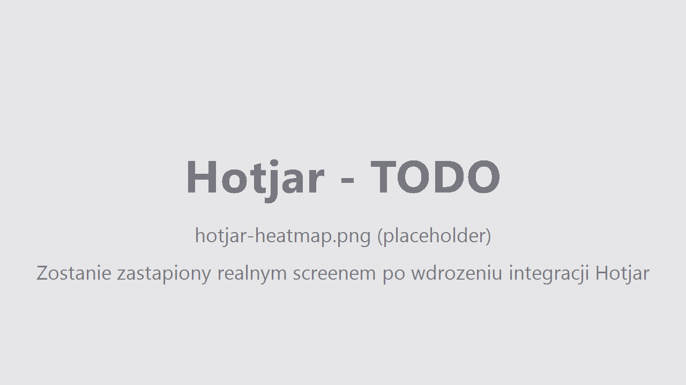

### Recording

